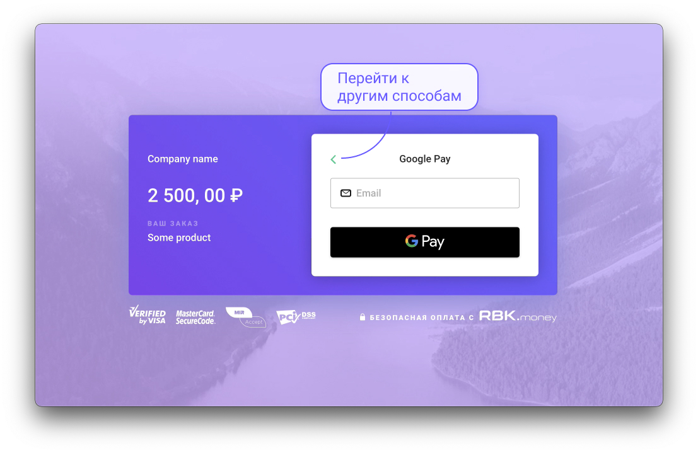
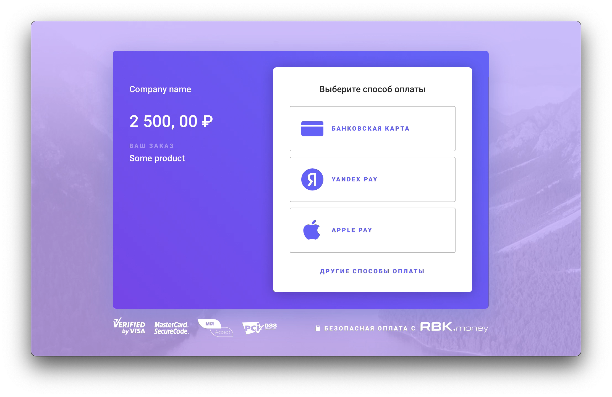
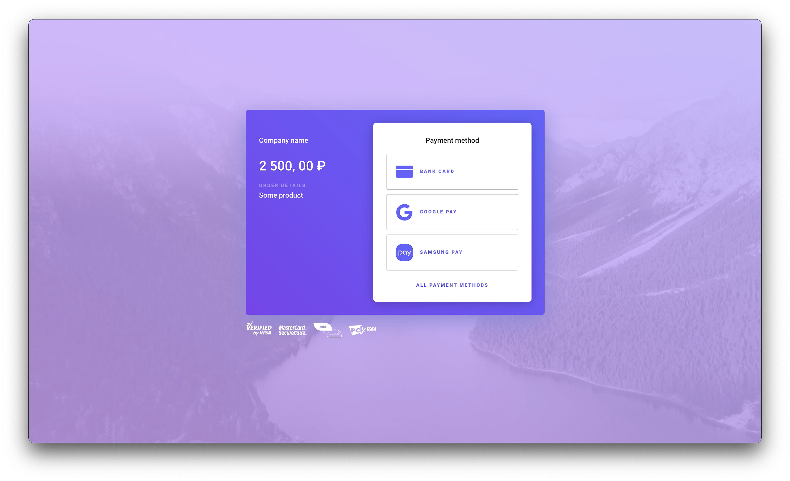
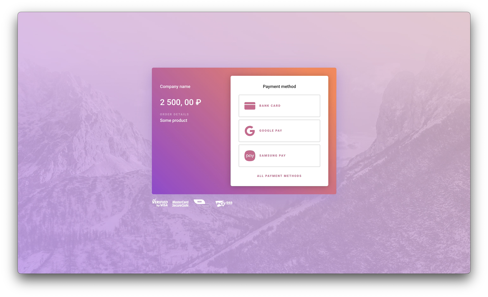

# Checkout

**Checkout** — решение, которое позволяет встроить готовую платёжную форму на ваш веб-сайт.

## Варианты реализации {#examples}

### Использование инвойса {#invoice}

Сценарий описан в [данной статье](https://developer.rbk.money/docs/payments/overview/#pay) (см. случай, когда оплата производится с платёжной формы RBK.money).

Ниже приведены:

* список возможных атрибутов для управления внешним видом и поведением платёжной формы;
* пример встраивания **Checkout** для HTML/JS;

#### HTML и JS {#htmlJsInvoice}

В данной таблице содержится список атрибутов, которые можно использовать как для HTML, так и для JS.

| data-* атрибут HTML           | Свойство конфигурации JS           | Описание                                                             | Обязательность | Возможные значения   |
| ----------------------- | ----------------------- |-------------------------------------------------------------------- | -----------| -------------------|
| data-invoice-id           |invoiceID | Идентификатор [инвойса](https://developer.rbk.money/docs/payments/overview/#invoice)                                                | +            | oVU2LzUCbQ           |
| data-invoice-access-token | invoiceAccessToken |[Ключ доступа к инвойсу](https://developer.rbk.money/docs/payments/overview/#invoiceAccessToken)                                | +            | eyJhbGciOiJSUzI1N... |
| data-name                 | name |Наименование компании или сайта                                |  -             | Company name         |
| data-description          | description | Описание продукта или сервиса                                 |
| data-email                | mail | email покупателя, будет предзаполнен на форме |       -       | example@mail.com     |
| data-obscure-card-cvv     | obscureCardCvv | Затенять карточный CVV-код                                          |        -      | true/false         |
| data-require-card-holder  | requireCardHolder | Требовать от покупателя заполнять поле «card holder»                  |      -        | true/false         |
| data-locale               | locale | Настройка локализации платёжной формы                                |     -         | auto/ru/en       |
| data-popup-mode           | popupMode | Открывать **Checkout** в новой вкладке браузера                          |        -      | true/false         |
| data-recurring           | recurring | Признак рекуррентного платежа                          |        -      | true/false         |

#### HTML {#htmlInvoice}

В данной таблице содержится список атрибутов, которые можно использовать только для HTML.

| data-* атрибут            | Описание                                                             | Обязательность | Возможные значения   |
| ----------------------- | -------------------------------------------------------------------- | -----------| -------------------|
| data-label                | Текст кнопки открытия формы                                          |       -       | Pay with RBK.money    |

```html
<form action="https://<your-server-side>" method="GET">
    <script src="https://checkout.rbk.money/checkout.js" class="rbkmoney-checkout"
            data-invoice-id="string"
            data-invoice-access-token="string"
            data-name="Company name"
            data-description="Some product"
            data-label="Pay with RBK.money">
    </script>
</form>
```

С помощью `form` можно задать url для [callback'a](https://developer.rbk.money/docs/payments/overview/#webhook) об успешном проведении платежа.

#### JS {#jsInvoice}

В данной таблице содержится список атрибутов, которые можно использовать только для JS.

| Свойство конфигурации    | Описание                                                             | Обязательность | Возможные значения   |
| ---------------------- | -------------------------------------------------------------------- | -----------| -------------------|
| opened                   | [callback'a](https://developer.rbk.money/docs/payments/overview/#webhook) об открытии окна **Checkout**                                   |      -        | function             |
| closed                   | [callback](https://developer.rbk.money/docs/payments/overview/#webhook) о закрытии окна **Checkout**                                   |     -         | function             |
| finished                 | [callback](https://developer.rbk.money/docs/payments/overview/#webhook) об успешном проведении платежа                              |      -        | function             |

```javascript
const checkout = RbkmoneyCheckout.configure({
    invoiceID: 'string',
    invoiceAccessToken: 'string',
    name: 'Company name',
    description: 'Some product',
    opened: function () {
        console.log('Checkout opened');
    },
    closed: function () {
        console.log('Checkout closed');
    },
    finished: function () {
        console.log('Payment successful finished');
    }
});

document.getElementById('customButton').addEventListener('click', function () {
    checkout.open();
});

window.addEventListener('popstate', function () {
    checkout.close();
});
```

### Использование шаблона инвойса {#invoiceTemplate}

Шаблон инвойса позволяет совершать произвольное количество [платежей](https://developer.rbk.money/api/#operation/createPayment) с идентичными параметрами без необходимости [создавать счёт](https://developer.rbk.money/api/#operation/createInvoice) для каждого из них.

Сценарий использования **Checkout** в данном случае аналогичен тому, что описан для [создания инвойса](#invoice). Однако, вместо метода [createInvoice](https://developer.rbk.money/api/#operation/createInvoice) используется [createInvoiceTemplate](https://developer.rbk.money/api/#operation/createInvoiceTemplate).

Список возможных атрибутов немного отличается от приведённого в [данном разделе](#invoice). Различия описаны таблицами ниже. В остальном наборы атрибутов идентичны.

При оплате шаблона инвойса покупатель может самостоятельно указать сумму. Возможность указания произвольной суммы задается при вызове [createInvoiceTemplate](https://developer.rbk.money/api/#operation/createInvoiceTemplate): см. `price` → `costType` для `templateType:InvoiceTemplateSingleLine`. 
Сумму также допускается [предзаполнить](#htmlJsTemplate) (без возможности ее редактирования на форме оплаты).

#### HTML {#htmlTemplate}

Данная таблица отражает различия в использовании атрибутов  для HTML.

| data-* атрибут (инвойс) | data-* атрибут (шаблон инвойса)                                                                        |
| ----------------------- | -----------|
| data-invoice-id           |data-invoice-template-id |
| data-invoice-access-token |data-invoice-template-access-token |

#### JS {#jsTemplate}

Данная таблица отражает различия в использовании атрибутов  для JS.

| data-* атрибут (инвойс)           | data-* атрибут (шаблон инвойса)                                                                        |
| ----------------------- | -----------|
| invoiceID            |invoiceTemplateID |
| invoiceAccessToken |invoiceTemplateAccessToken |

#### HTML и JS {#htmlJsTemplate}

Для того чтобы предзаполнить сумму оплаты для покупателя, необходимо передать нижеописанный параметр.

| data-* атрибут HTML | Свойство конфигурации JS | Описание |  Тип |
| ---------------------------- | ------------------------| -----------------------------------------------------------------------------------------------------------------------| ---------------- |
| data-amount | amount| Сумма к оплате в минорных денежных единицах, например в копейках (в случае указания российских рублей в качестве валюты)|  integer |

### Рекуррентный платеж {#recurring}

Описание рекуррентных платежей и сценарии их использования отражены в [данной](https://developer.rbk.money/docs/payments/recurring/recurring/) статье.

Список возможных атрибутов при создании подобного платежа немного отличается от приведённого в [данном разделе](#invoice): требуется передать идентификатор плательщика и ключ доступа к операциям с использованием принадлежащего ему источника денежных средств. Различия описаны таблицами ниже. В остальном наборы атрибутов идентичны.

#### HTML {#htmlRecurring}

Данная таблица отражает различия в использовании атрибутов  для HTML.

| data-* атрибут (инвойс) | data-* атрибут (шаблон инвойса) |
| ----------------------- | -----------|
| data-invoice-id           | data-customer-id | + |
| data-invoice-access-token | data-customer-access-token |

#### JS {#jsRecurring}

Данная таблица отражает различия в использовании атрибутов  для JS.

| data-* атрибут (инвойс) | data-* атрибут (шаблон инвойса)                                                                        |
| ----------------------- | -----------|
| invoiceID            | customerID |
| invoiceAccessToken | customerAccessToken |

#### HTML и JS {#htmlJsRecurring}

Для того чтобы обозначить платеж в качестве [родительского](https://developer.rbk.money/docs/payments/recurring/recurring/#cases), необходимо передать нижеописанный параметр.

| data-* атрибут HTML | Свойство конфигурации JS |  Описание                                 | Возможные значения | Значение по умолчанию  |
| ---------------------------- | ------------------------| ------------------------| -------------------------------------- |  -------------------- |
| recurring                      | data-recurring            |  Признак выполнения рекуррентного платежа | true/false       | false                  |

### Платеж с удержанием денежных средств {#hold}

Вышеописанные [варианты реализации](#examples) подразумевают одноэтапный или двухэтапный процесс проведения платежа при оплате [инвойса](https://developer.rbk.money/docs/payments/overview/#invoice)/шаблона инвойса.

Одноэтапное проведение говорит о немедленном списании денежных средств с покупателя. Двухэтапное — об их временном удержании (холдировании) до момента подтверждения покупки [мерчантом](https://developer.rbk.money/docs/payments/overview/#lk): подробности см. в описании раздела «Подтвердить или отменить оплату заказа» [данного](https://help.rbkmoney.com/lk/lk/#confirmPay) руководства пользователя.

Для проведения платежа с удержанием средств необходимо:

* передать соответствующий [атрибут](#htmlJsHold) со значением `true`;
* выбрать [политику](#htmlJsHold), которая будет применена по истечении срока удержания денежных средств:
    * cancel - удержанные денежные средства вновь станут доступны покупателю: не поступят в пользу [мерчанта](https://developer.rbk.money/docs/payments/overview/#lk).
    * capture -  денежные средства поступят в пользу [мерчата](https://developer.rbk.money/docs/payments/overview/#lk).

В остальном, список возможных атрибутов не отличается от приведённых в разделе [«Использование инвойса»](#invoice)/[«Использование шаблона инвойса»](#invoiceTemplate)/[«Рекуррентный платеж»](#recurring) (в зависимости от выбранного вида оплаты).

#### HTML и JS {#htmlJsHold}

Для того чтобы захолдировать денежные средства покупателя,  необходимо передать нижеописанные атрибуты.

| data-* атрибут HTML | Свойство конфигурации JS | Описание                                                | Возможные значения |
| ----------------------------| ------------------------| ----------------------------------------------------- | -----------------|
| data-payment-flow-hold                |   paymentFlowHold  | Признак холдирования средств | true/false       |
| data-hold-expiration                 |     holdExpiration  | Политика управления захолдированными средствами    | cancel/capture   |

## Ограничения {#restrictions}

* **Checkout** позволяет получить [callback](https://developer.rbk.money/docs/payments/overview/#webhook) только об успешном завершении платежа: [callback](https://developer.rbk.money/docs/payments/overview/#webhook) о других состояниях платежа не поддерживается.
* В случае неуспешной попытки проведения платежа, покупателю будет предложено вновь совершить оплату. Количество попыток не ограничено в рамках действия времени жизни [инвойса](https://developer.rbk.money/api/#operation/createInvoice)/[шаблона инвойса](https://developer.rbk.money/api/#operation/createInvoiceTemplate).

## Управление методами оплаты {#paymentMethod}

Ниже представлен список атрибутов, с помощью которых можно управлять отображением определённых способов оплаты на платежной форме.

| Метод оплаты         | data-* атрибут HTML | Свойство конфигурации JS | Возможные значения | Значение по умолчанию  |
| -----------------  | ---------------------------- | ------------------------| -----------------| -------------------- |
| Банковская карта     | data-bank-card                        |     bankCard       | true/false       | true                   |
| Электронные кошельки | data-wallets                        |      wallets         | true/false       | true                   |
| Терминалы оплаты     | data-terminals                      | terminalsdata-terminals            | true / false       | true                   |
| Apple Pay            | data-apple-pay                       |     applePay        | true/false       | true                   |
| Google Pay           | data-google-pay                      |         googlePay   | true/false       | true                   |
| Samsung Pay          | data-samsung-pay                     |     samsungPay      | true/false       | true                   |
| Счёт мобильного телефона        | data-mobile-commerce                 |   mobileCommerce    | true/false       | true                   |

Имеется возможность принудительно отобразить на форме один конкретный способ оплаты.

Пример: перечислив необходимые [методы](#paymentMethod), которые должны быть доступны покупателю, дополнительно указываем, какой способ будет предложен самым первым. Попав на форму оплаты, покупатель увидит лишь его, однако при необходимости сможет перейти к [остальным](#paymentMethod).




Для того, чтобы задать первоочередной способ оплаты, необходимо передать атрибут `data-initial-payment-method` (для HTML)/
`initialPaymentMethod` (для JS), указав одно из его возможных значений:

* `bankCard` - банковская карта;
* `terminalEuroset` - терминалы «Евросеть»;
* `walletQiwi` - электронный кошелек «Qiwi»;
* `applePay` - Apple Pay;
* `googlePay` - Google Pay;
* `samsungPay` - Samsung Pay;
* `mobileCommerce` - Счет мобильного телефона.

## Управление темой {#theme}

Ниже представлен атрибут, с помощью которых можно управлять внешним видом формы: фоном, цветом элементов, дизайном кнопок.

| data-* атрибут HTML | Свойство конфигурации JS | Описание                                 | Возможные значения | Значение по умолчанию  |
| ---------------------------- | ------------------------| -------------------------------------- | -----------------| -------------------- |
| data-theme                          |     theme            | Название выбранной темы                  | main/coral       | main                   |

**main**



**coral**



## Частые ошибки {#doNotDoThat}

### Блокировка функции открытия Сheckout

Не вызывайте функцию открытия **Сheckout** в callback. Большинство мобильных браузеров блокируют подобное поведение. Открытие нового окна должно происходить в результате действия пользователя.

```javascript
// Будет работать:
document.getElementById("button").addEventListener("click", function() {
    checkout.open();
});

// Не будет работать:
document.getElementById("button").addEventListener("click", function() {
    someFunction().then(function() {
        checkout.open();
    });
});
```

### «RbkmoneyCheckout is not defined»

При некорректном встраивании **Checkout** в код страницы оплаты может возникать ошибка  «RbkmoneyCheckout is not defined». Она связана с тем, что вы вызываете функцию `RbkmoneyCheckout.configure()` до полной инициализации DOM. Используйте подходящие вам практики, для того чтобы обеспечить вызов платежной формы после полной инициализации модели документа.

Частный случай решения этой задачи с использованием `jquery`, указывающий направление ее решения, может выглядеть так:

```html
<!DOCTYPE html>
<html>
<head>
    <script src="https://code.jquery.com/jquery-3.3.1.min.js" integrity="sha256-FgpCb/KJQlLNfOu91ta32o/NMZxltwRo8QtmkMRdAu8=" crossorigin="anonymous"></script>
    <script type="text/javascript" src="https://checkout.rbk.money/checkout.js"></script>
</head>
<body>
    <script>
    $(function() {
        $('#rbkmoney-checkout').on('click', function(e) {
            e.preventDefault();
            const checkout = initCheckout('{INVOICE_ID}', '{INVOICE_ACCESS_TOKEN}');
            checkout.open();
        });
    
        function initCheckout(invoiceID, invoiceAccessToken) {
            return RbkmoneyCheckout.configure({
                invoiceID: invoiceID,
                invoiceAccessToken: invoiceAccessToken,
                name: 'Product name',
                description: 'Product description',
                email: 'example@example.com',
                finished: function() {
                    console.log('Payment successful finished');
                },
                opened: function() {
                    console.log('Checkout opened');
                },
                closed: function() {
                    console.log('Checkout closed');
                }
            });
        }
    });
    </script>
    <button id="rbkmoney-checkout">Pay with RBKmoney</button>
</body>
</html>
```
