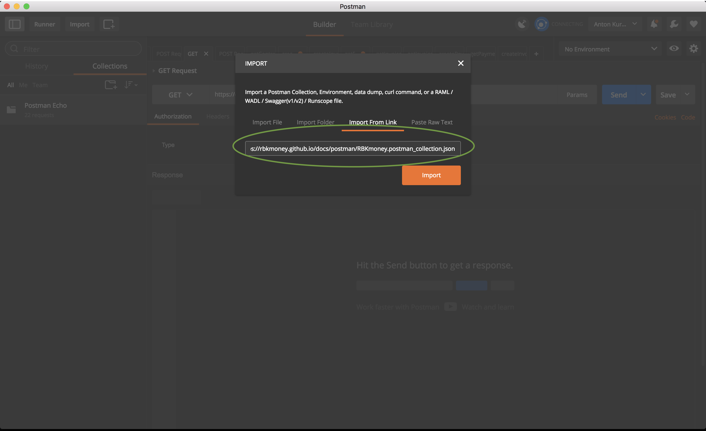
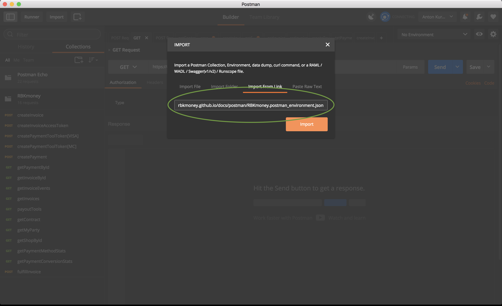
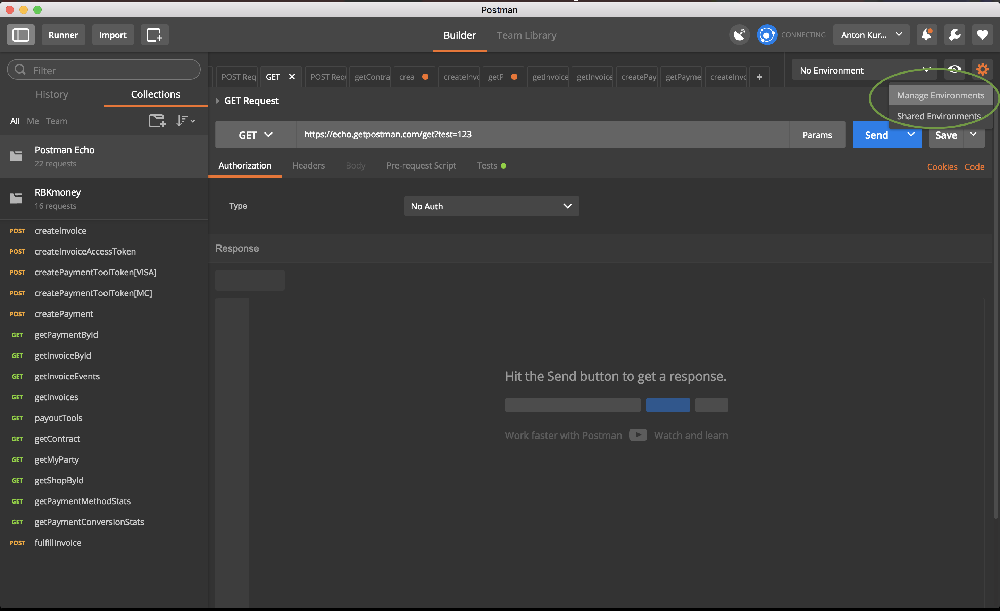
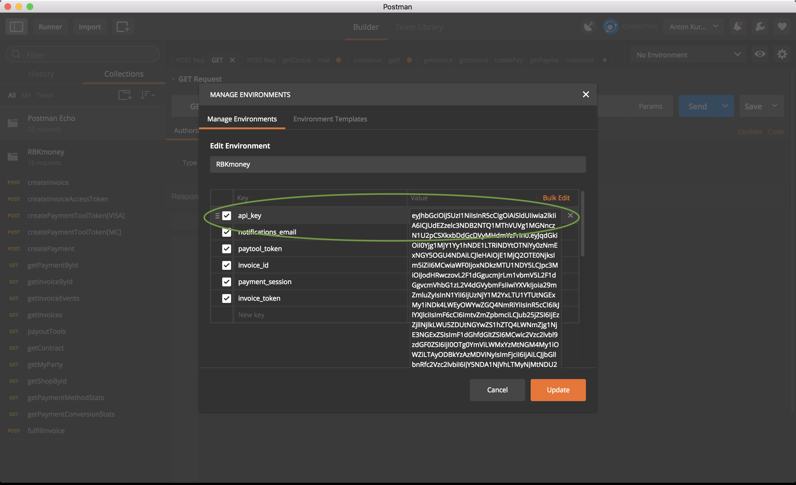
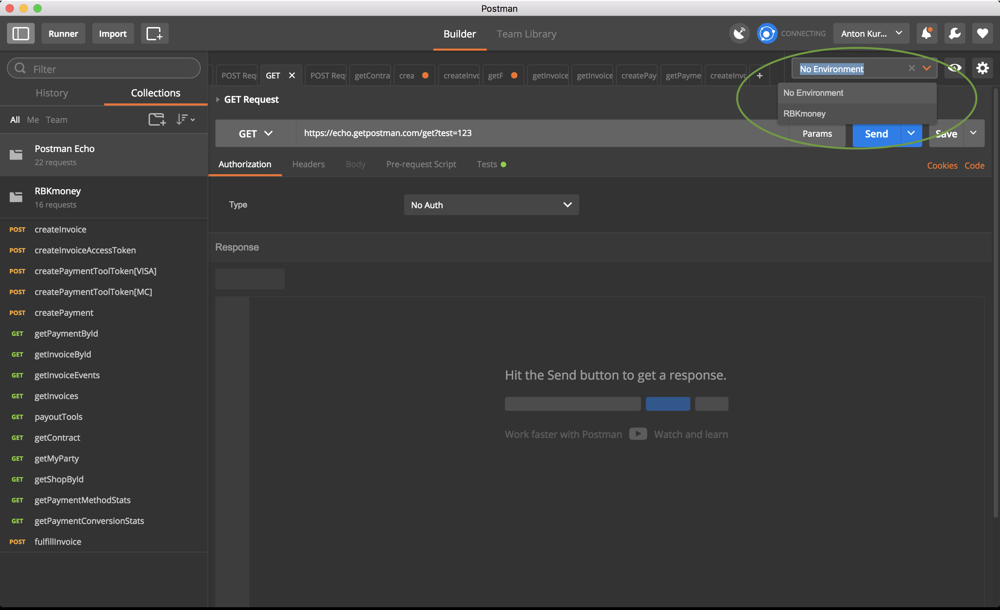
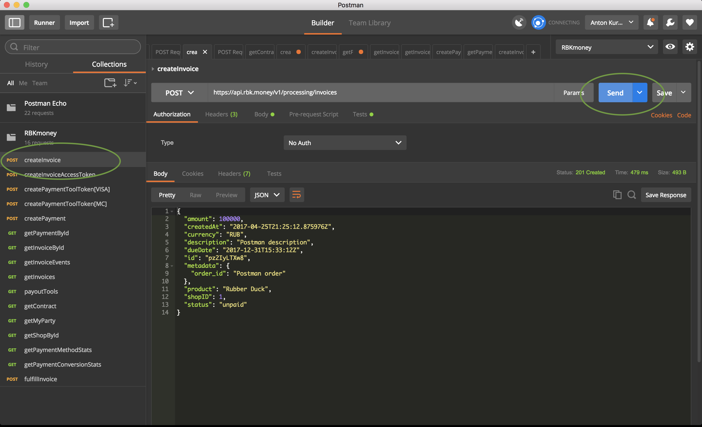

## Тестирование API с помощью Postman

- [Postman](https://www.getpostman.com/) предоставляет удобный GUI для работы с API подобными нашему и позволяет делать подстановку переменных из результатов выполненного запроса в последующие, что удобно при выполнении каскадных вызовов API.
- Для этого импортируйте [коллекцию RBK.money API](/docs/payments/postman/RBKmoney.postman_collection.json), [коллекцию RBK.money Wallets](/docs/payments/postman/RBKmoney.Wallets.postman_collection.json) и [переменные окружения](/docs/payments/postman/RBKmoney.postman_environment.json) в ваш экземпляр программы.

!!! note "Подсказка" 
	Удобнее всего скопировать ссылки на [коллекцию](/docs/payments/postman/RBKmoney.postman_collection.json) и [переменные окружения](/docs/payments/postman/RBKmoney.postman_environment.json) и импортировать их, вставив через меню _File->Import->Import From Link_

- импортируйте коллекцию:

- импортируйте переменные окружения:

- Выберите &#9881;_->Manage Environments->RBKmoney_:

- замените значение **api_key** на ваш [API-ключ](https://dashboard.rbk.money/tokenization), а также **notifications_email** на адрес вашей почты, если хотите получать уведомления о платежах и инвойсах от платформы:

- Другие значения ключей изменять не нужно, их значения Postman подставит автоматически при вызове соответствующих методов API.

- Выберите переменные окружения RBKmoney в меню выбора:

- сделайте вызов любого метода RBKmoney API, например, createInvoice() чтобы создать в системе инвойс и получить его данные:

