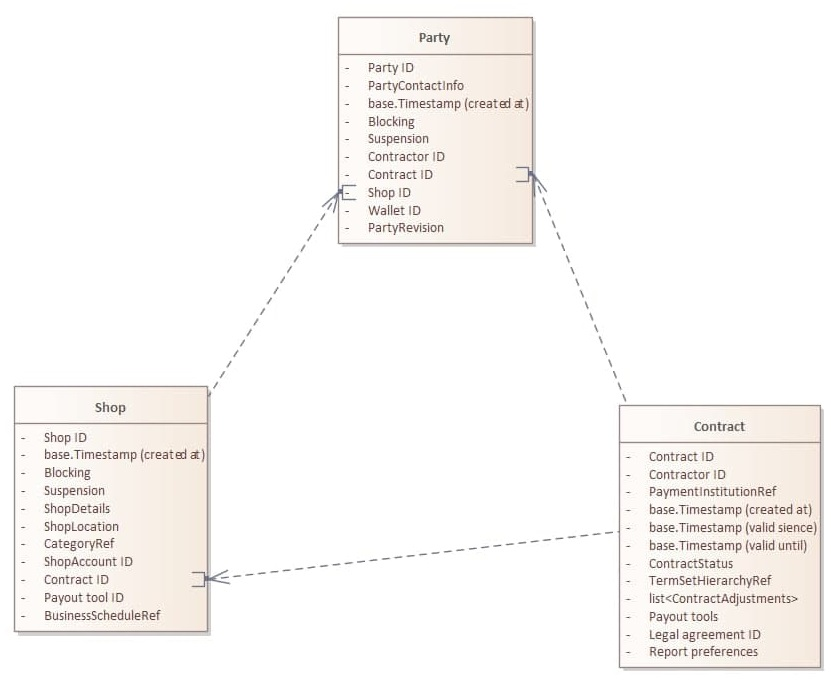

# Hellgate
<!-- Insert your shields here -->

<!-- TOC -->
## Содержание 
- [Общее описание](#Общее-описание)
- [Структура сервиса](#Структура-сервиса)
   - [Party management](#Party-management)
   - [Бизнес-логика проведения платежей](#Бизнес-логика-проведения-платежей)
- [Связанные сервисы](#Связанные-сервисы)
- [Составители](#Составители)

## Общее описание

**Hellgate (Payments Processing Core Service)** - сервис, отвечающий за:
1. Party management (управление участниками); 
2. обслуживание бизнес-логики платежей;
3. обслуживание связок платежный инструмент - плательщик.

## Структура сервиса
 
**Hellgate** состоит из трех модулей:
1. Party management. Включает в себя управление:
   - магазинами;
   - участниками.
2. Бизнес-логика проведения платежей. Включает в себя управление:
   - инвойсами;
   - платежами;
   - контрактами.
3. Обслуживание связок платежный инструмент - плательщик. Включает в себя управление платежным инструментом, плательщиком и их взаимодействием в рамках рекуррентных платежей.

### Party management 

В модуле *Party management* возможно:
- создание и удаление *party*. *Party* - сущность, представляющая мерчанта в платформе;
- блокировка и разблокировка *party*;
- активация *party*;
- управление кошельками (блокировка и активация) по *party* кошелька;
- создание сущности *Contract*;
- создание сущности *Shop*.            
Идентификация *party* происходит по уникальному id, присваиваемому при создании *party*.

Зависимость основных сущностей *Party* представлена ниже.

### Бизнес-логика проведения платежей

В модуле бизнес-логики проведения платежей **Hellgate** может производить мониторинг состояний:
* инвойсов и платежей;
* возвратов платежей;
* возмещений мерчантам. 

### Обслуживание связок платежное средство - плательщик

В модуле обслуживания связок платежное средство - плательщик возможно:
- создание плательщика;
- удаление плательщика;
- получение уведомлений о событиях плательщика;
- создание платежного инструмента;
- удаление платежного инструмента;
- создание связки плательщик - платежный инструмент.  

## Связанные сервисы
* Machinegun
* Dominant
* Shumway
* Fault-detector
* Fraudbusters
* CAPI
* Hooker
* Magista-kafka

## Составители