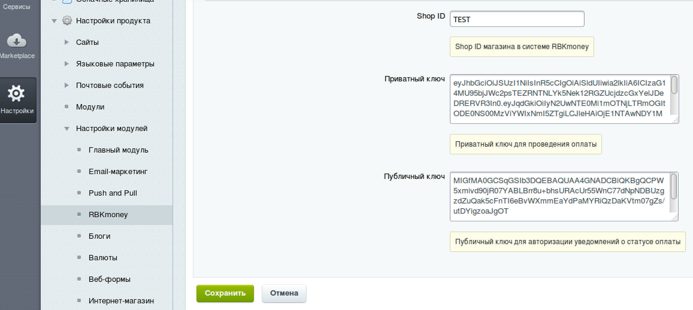

# Платежный плагин RBKmoney для CMS Bitrix

- Модуль доступен для скачивания в нашем [открытом репозитории на GitHub](https://github.com/rbkmoney/rbkmoney-cms-bitrix/archive/master.zip);
- Текущая стабильная версия модуля - 1.0.

### Установка и настройка модуля

- Скопируйте папку `rbkmoney_checkout` и все ее содержимое на ваш сервер в `\bitrix\modules\`
- В "Управление модулями" найдите модуль `«RBKmoney (rbkmoney_checkout)` и установите его.

В поля «Публичный ключ для авторизации уведомлений о статусе оплаты», «Приватный ключ для проведения оплаты», «Номер магазина в системе RBKmoney» заполните данными из Личного Кабинета Мерчанта [https://dashboard.rbk.money/](https://dashboard.rbk.money/).


- Перейдите в «Настройки» -> «Настройки модулей» -> «RBKmoney»;
- Заполните основные настройки для работы модуля.



- Перейдите в «Магазин» -> «Платежные системы» и нажмите на кнопку «Добавить платежную систему»;
- Выберите RBKmoney и заполните данные в открывшемся окне:


В качестве `Callback Url`-а для обработки уведомления от платежной системы в личном кабинете укажите URL:

```
https://<your-bitrix-site>/personal/order/rbkmoney_checkout/notification.php
```

Чтобы уведомления от платежной системы доходили, необходимо будет добавить публичный ключ, который можно получить в личном кабинете и добавить его в настройках модуля в поле "Публичный ключ для авторизации уведомлений о статусе оплаты".

- Заполните оставшиеся поля и нажмите кнопку «Применить».

Все запросы и ответы логируются, с ними можно ознакомиться в разделе `Журнал событий`.

### Нашли ошибку или у вас есть предложение по улучшению модуля?

Пишите нам support@rbkmoney.com При обращении необходимо:

- Указать наименование CMS и компонента магазина, а также их версии;
- Указать версию платежного модуля (доступна на странице Управление пакетами);
- Описать проблему или предложение;
- Приложить снимок экрана (для большей информативности).
