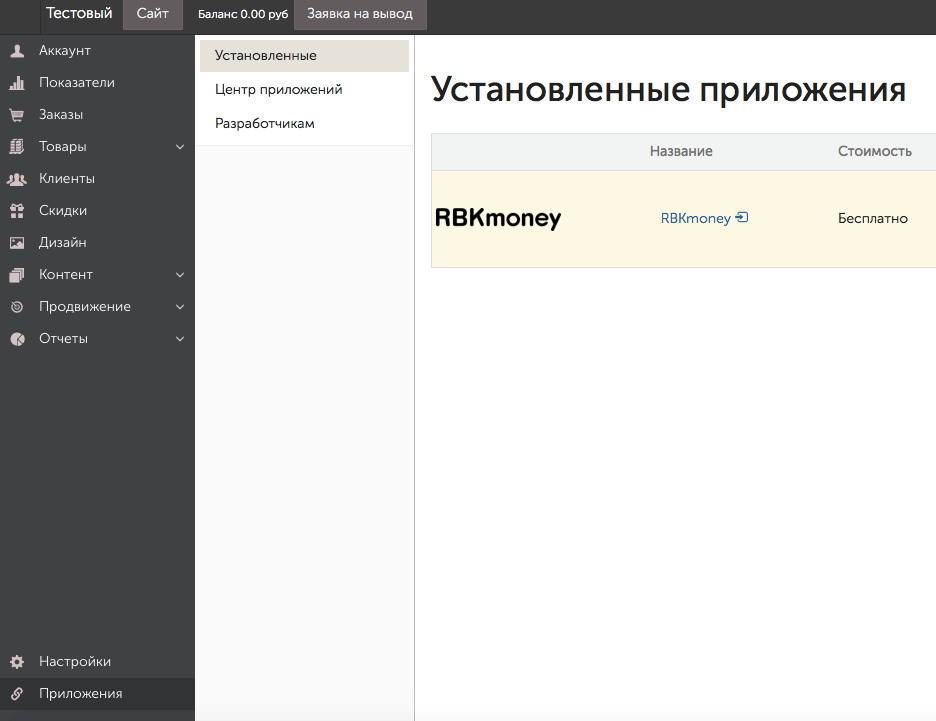
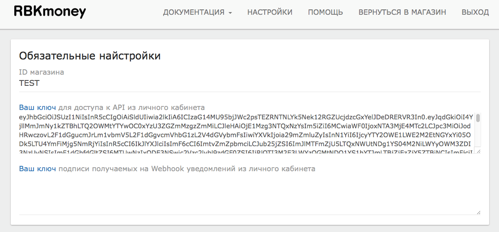
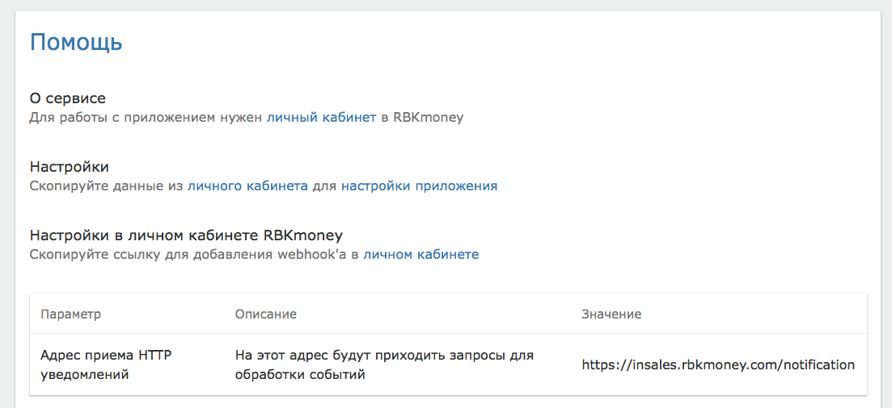
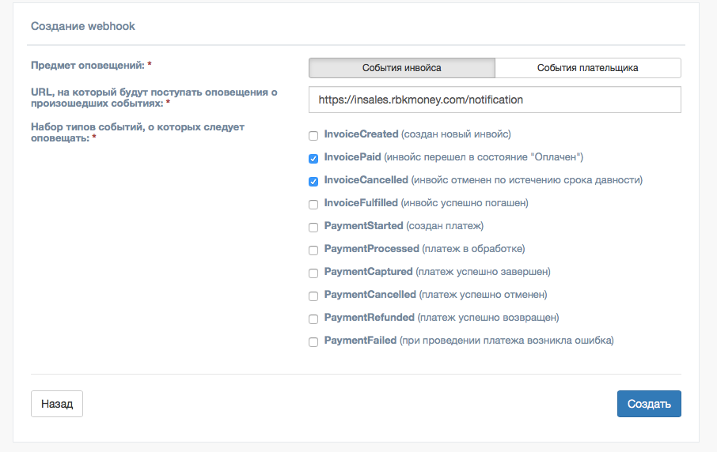
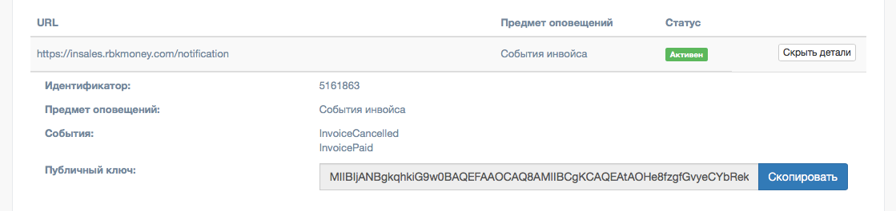
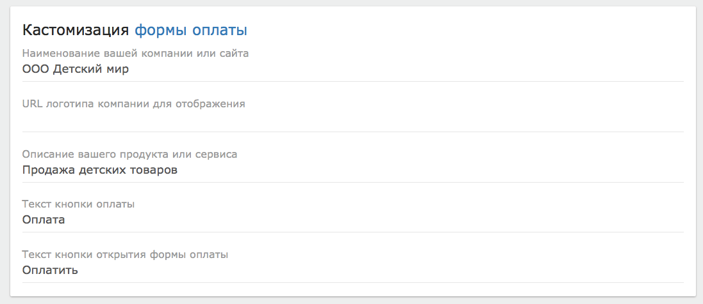
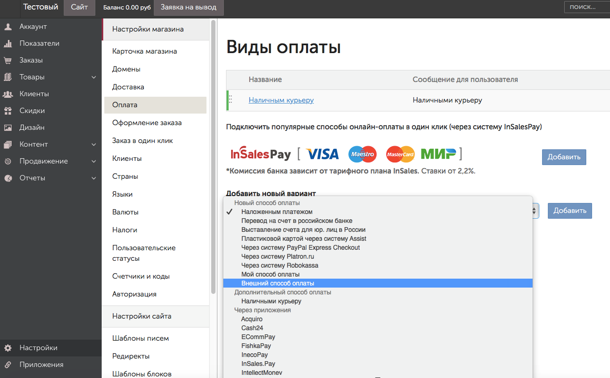
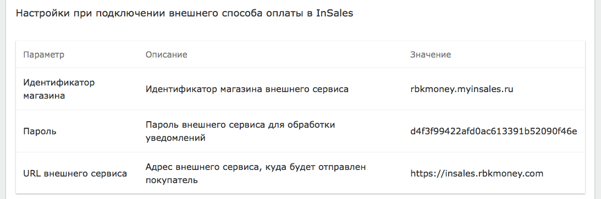

# Модуль приема платежей RBKmoney для CMS InSales

Прием платежей через платежную систему RBKmoney осуществляется с помощью Приложения RBKmoney, которое можно установить в [Маркетплейсе интеграций InSales](https://www.insales.ru/collection/all/product/rbkmoney).

## Зарегистрируйтесь в RBKmoney

Для приема платежей через RBKmoney, Вам необходимо заключить договор с нашей платежной системой.

Для этого необходимо:

- Подать заявку на подключение к Системе RBKmoney по [ссылке](https://welcome.rbk.money/)
- Зарегистрировать аккаунт в Системе RBKmoney по [ссылке](https://dashboard.rbk.money/) и создать магазин.

После оформления заявки с Вами свяжется менеджер компании для заключения договора.

## Установите Приложение RBKmoney 

 - Установите приложение по [ссылке](https://www.insales.ru/collection/all/product/rbkmoney).

## Настройка Приложения

### Настройки в личном кабинете RBKmoney

Переходим в установленные приложения в магазине InSales и выбираем платежный модуль по названию RBKmoney:

Нажимаем на название RBKmoney и переходим на страницу с настройками приложения.

- ID магазина – это Ваш идентификатор магазина из RBKmoney. Скопируйте его в Личном кабинете RBKmoney в разделе "Детали магазина" – поле "Идентификатор";
- Ваш ключ для доступа к API из личного кабинета – это Ваш ключ для доступа к API. Скопируйте его в Личном кабинете RBKmoney в разделе "API Ключ":

- Ваш ключ подписи получаемых на Webhook уведомлений из личного кабинета.

Для заполнения этого поля необходимо:

- перейти в раздел "Помощь" магазина InSales, скопировать "Адрес приема HTTP уведомлений":

- вставить в Личном кабинете RBKmoney в раздел "Webhooks";
- Создать Webhook;
– Скопировать в поле URL;
– Выбрать Типы событий "InvoicePaid" и "Invoice Canсelled":

- после создания Webhook копируем "Публичный ключ" через открытие "Показать детали" и вставляем в поле "Ваш ключ подписи получаемых на Webhook уведомлений из личного кабинета":

- Заполняем форму "Кастомизация формы оплаты" и сохраняем настройки:

 
### Настройки при подключении внешнего способа оплаты в InSales

- Через нажатие поля "Вернуться в магазин" (на верхней панели магазина), заходим в "Настройки";
- "Оплата" - "Добавить новый вариант";
- "Внешний способ оплаты" - "Добавить":

- Для заполнения полей в форме копируем информацию из уже известного нам раздела "Помощь" магазина InSales:

- Сохраняем настройки.

### Готово!

Ваш Интернет-магазин готов принимать оплату с помощью RBKmoney!
