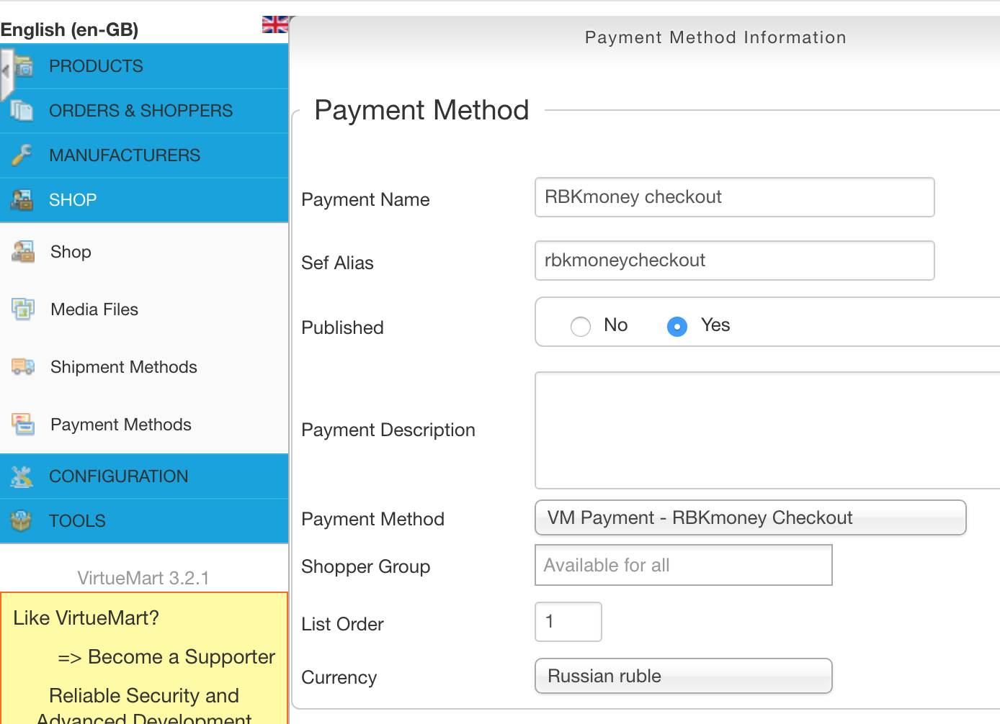
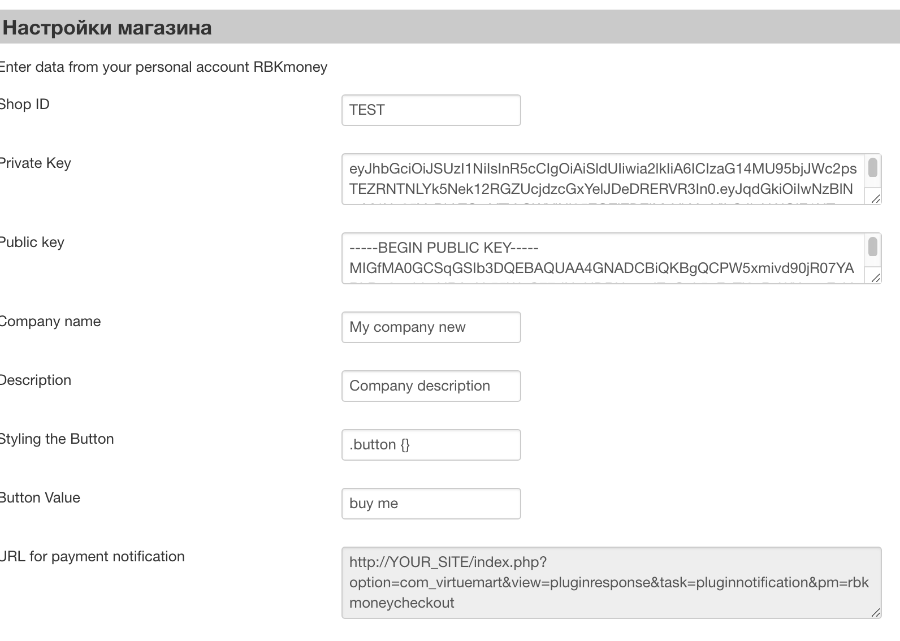
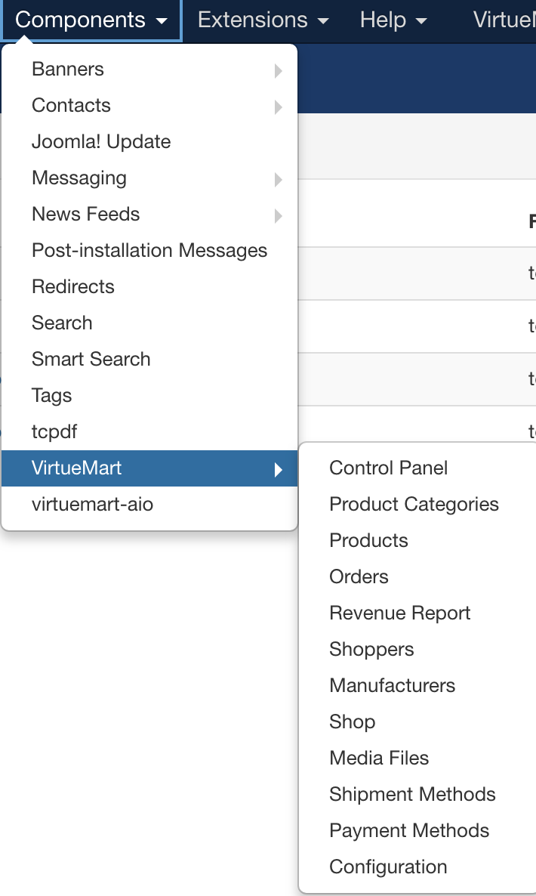

# Платежный плагин RBKmoney для Joomla с модулем VirtueMart

- Модуль доступен для скачивания в нашем [открытом репозитории на GitHub](https://github.com/rbkmoney/rbkmoney-cms-joomla-virtuemart/releases/latest);
- Текущая стабильная версия модуля - v1.0.

## Совместимость

- Joomla 3.6.5;
- VirtueMart 3.2.1.

### Требования к среде

- PHP 5.4 и выше;
- OpenSSL - 1.0.2k-fips и выше;
- Curl.

### Доступные ставки НДС для корзины

- ничего не указано - без НДС;
- 0 - 0% НДС;
- 10 - 10% НДС;
- 18 - 18% НДС;
- ставки, отличающиеся от этих, будут определяться как ставка `без НДС`.

## Установка и настройка модуля

Перед установкой, создаем архив `rbkmoneycheckout.zip` помещая в него содержимое папки `rbkmoneycheckout`.

- Устанавливаем плагин через менеджер расширений (`administrator/index.php?option=com_installer&view=install`):

- Выбираем наш архив и устанавливаем его:

- Включаем плагин (`administrator/index.php?option=com_installer&view=manage`):

- Выбираем платежные методы:

- Добавляем способ оплаты в Virtuemart (`administrator/index.php?option=com_virtuemart&view=paymentmethod`):

- Выбираем модуль RBKmoney, в нем на первой вкладке:

- Название - RBKmoney;
- опубликовано - "да";
- платежный метод - RBKmoney.

## Настройка модуля

- во вкладке `Конфигурация` прописываем данные, полученные в системе RBKmoney:

- настраиваем плагин в соответствие с данными из [личного кабинета RBKmoney](https://dashboard.rbk.money):

	- `Shop ID` - идентификатор магазина из RBKmoney. Скопируйте его в Личном кабинете RBKmoney в разделе Детали магазина, поле Идентификатор;
	- `Private key` - ключ для доступа к API. Скопируйте его в Личном кабинете RBKmoney в разделе API Ключ;
	- `Public key` - ключ для обработки уведомлений о смене статуса.

### Настройка вебхуков

- заходим в личный кабинет RBKmoney: Создать Webhook;
- вставляем в поле URL вида `http://YOUR_SITE_NAME/index.php?option=com_virtuemart&view=pluginresponse&task=pluginnotification&pm=rbkmoneycheckout`, скопированного из `URL для уведомлений`;
- выбираем типы событий `InvoicePaid` и `Invoice Canсelled`;
- после создания Webhook-а копируем публичный ключ из деталей вебхука;
- скопированный ключ вставляем в поле `Публичный ключ` на странице настроек модуля;
- сохраняем изменения и проведите тестовый платеж.

### Логи

- логи доступны по пути `VirtueMart / Tools / Logs`, после чего выбираем необходимый файл с логами:

- можем выбрать логи и ознакомиться с содержимым интересующего нас файла:

