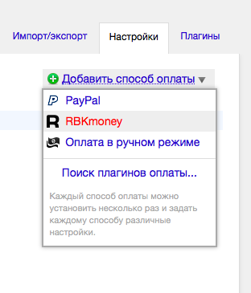
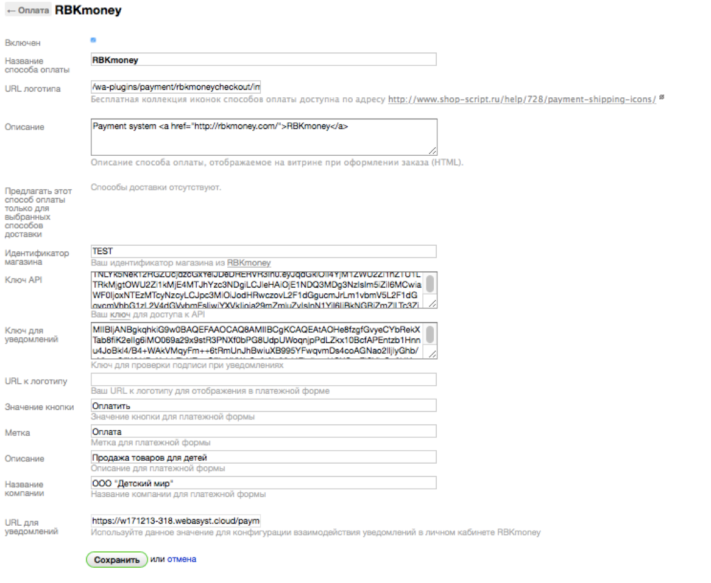

# Модуль приема платежей RBKmoney для CMS Shop-Script (Webasyst)

Прием платежей в Shop-Script через платежную систему RBKmoney осуществляется с помощью плагина, который можно установить с помощью приложения "Инсталлер". Плагин можно скачать [в магазине Webasyst](https://www.webasyst.ru/store/plugin/payment/rbkmoneycheckout/).

## Зарегистрируйтесь в RBKmoney

Для приема платежей через RBKmoney, Вам необходимо заключить договор с нашей платежной системой.

Для этого необходимо:

- подать заявку на подключение к Системе RBKmoney по [ссылке](https://welcome.rbk.money/);
- зарегистрировать аккаунт в Системе RBKmoney по [ссылке](https://dashboard.rbk.money/) и создать магазин.

После оформления заявки с Вами свяжется менеджер компании для заключения договора.

## Установите плагин

Если вы раньше никогда не пользовались Webasyst, то сначала зарегистрируйтесь в облаке Webasyst (это намного проще и бесплатно в течение первых 30 дней) или установите Webasyst на своем сервере (потребуется умение устанавливать PHP-скрипты).

После регистрации аккаунта Webasyst, установите платежный плагин RBKmoney

- в бекенде вашего Вебасиста перейдите в приложение "Инсталлер";
- найдите плагин RBKmoney в секции "Плагины → Платежные системы";
- щелкните по кнопке "Установить".

### Добавьте способ оплаты в Shop-Script

- перейдите в бекенд Shop-Script;
- откройте раздел "Настройки → Оплата" и выберите RBKmoney в выпадающем меню;
- "Добавить способ оплаты" в верхнем правом углу. Если такого варианта в вашем списке нет, то, значит, вы не установили плагин в "Инсталлере", как было описано выше;

- на странице настройки модуля введите желаемое название и описание способа оплаты — так, как они должны отображаться для покупателей в процессе оформления заказа.

### Укажите параметры модуля

- идентификатор магазина
	- идентификатор магазина из RBKmoney. Скопируйте его в Личном кабинете RBKmoney в разделе "Детали магазина", поле "Идентификатор";
- ключ API
	- ключ для доступа к API. Скопируйте его в Личном кабинете RBKmoney в разделе "API Ключ"
- ключ для уведомлений
	- на странице настройки модуля скопировать URL из поля "URL для уведомлений" и вставить в разделе "Webhooks";
	- личный кабинет RBKmoney: "Создать Webhook";
	- скопировать в поле URL;
	– выбрать Типы событий "InvoicePaid" и "Invoice Canсelled";
- после создания Webhook далее копируем "Публичный ключ" через открытие "Показать детали";
- скопированный ключ вставляем в поле "Ключ для уведомлений" на странице настройки модуля;
- значение кнопки - значение кнопки в платежной форме, например, "Оплатить" или "Завершить оплату";
- метка - метка для перехода к платежной форме, например, "Оплата" или "Перейти к оплате";
- описание – сообщение покупателю, которое будет размещено в платежной форме, может содержать описание деятельности Вашей компании.

## Готово!

Ваш интернет-магазин готов принимать оплату с помощью RBKmoney!
