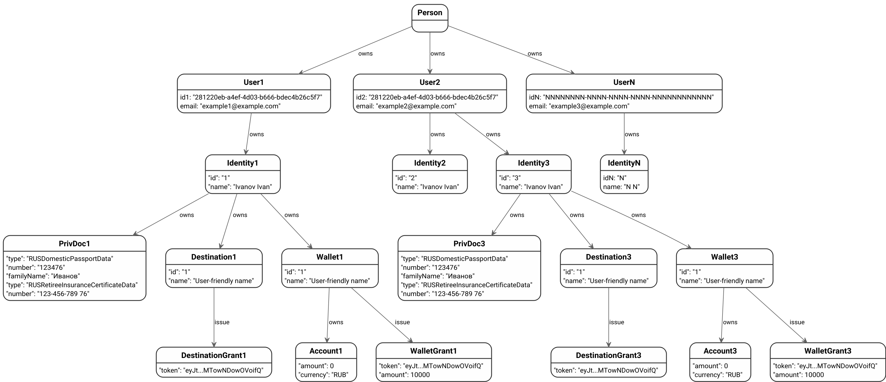

Электронные кошельки RBKmoney — это сервис, позволяющий проводить операции над электронными денежными средствами клиентов-физических или юридических лиц без открытия счета в системе. 

Терминология, правила и ограничения сервиса реализованы с учетом требований Регуляторов отрасли (в частности, [Федеральный закон от 27.06.2011 N 161-ФЗ](http://pravo.gov.ru/proxy/ips/?docbody=&nd=102148779)).

Дополнительно к `RBKmoney Wallet` мы предоставляем `RBKmoney Identity Storage` - сервис безопасного хранилища данных личных документов физических лиц, таких как паспорт, номер СНИЛС, ИНН и пр. Сервис `RBKmoney Identity Storage` может использоваться как в связке с кошельками, реализуя услуги идентификации физических лиц, так и в качестве отдельного сервиса по хранению персональных данных, соответствующего всем требованиям Регулятора.

## Возможности RBKmoney Wallet

Пример услуг, оказываемых на базе технологической платформы `RBKmoney Wallet`:

- создание и управление электронным кошельком клиента и его идентификация;
- эмиссия электронных денежных средств (ЭДС) путем пополнения кошелька с любого из доступных в платежной платформе RBKmoney метода оплаты;
- движение ЭДС между кошельками RBKmoney, переводы на кошельки других клиентов в рамках платформы;
- вывод ЭДС на банковскую карту, привязанную к кошельку владельца.

## Терминология и сущности

Реализованные технические сущности отражают картину реального мира, где владельцем кошелька является физическое либо юридическое лицо. Владелец может предоставить возможность вам, как мерчанту, управлять всеми или некоторыми ресурсами принадлежащего ему кошелька. Например - предоставить возможность от его имени сделать выплату на карту, или перевести определенную часть средств с его кошелька на другой.

В технической реализации предоставление подобных прав реализовано в соответствии со стандартным [протоколом OAuth 2.0](https://oauth.net/2/) и производится в браузере плательщика.

Владелец, реальное физическое или юридическое лицо, может зарегистрировать произвольное количество учетных записей, или User'ов в сервисе `RBKmoney Auth`.

### User

User, или пользователь системы — это уникальная учетная запись в авторизационных сервисах `RBKmoney Auth`, принадлежащая физическому либо юридическому лицу-клиенту системы. Зарегистрировавшись в `RBKmoney Auth`, клиент получает возможность создать себе кошелек, либо предоставить такую возможность вам, предоставив по вашему запросу соответствующий Grant в терминологии OAuth2.

Уникальным идентификатором User'а является его **e-mail**.

!!! note
	Обратите внимание!
	`RBKmoney Auth` — это централизованная служба аутентификации и авторизации, предоставляющая услуги SSO (Single sign-on). Это означает, например, что, создав учетную запись мерчанта платежной платформы `RBKmoney Payments` вы получите возможность зайти в ваш кошелек под тем же логином и паролем. Обратное верно.

Пример структуры, описывающей User'а может выглядеть так:

```json
{
  "id": "281220eb-a4ef-4d03-b666-bdec4b26c5f7",
  "createdTimestamp": 1479212158721,
  "username": "nickname",
  "enabled": true,
  "firstName": "Ivan",
  "lastName": "Ivanov",
  "email": "example@example.com"
}
```

User — это единственная уникальная сущность в рамках Платформы. User может быть владельцем произвольного количества Identity.

### Identity

Identity, или идентификатор личности — это структура `RBKmoney Wallet`, описывающая личность владельца кошелька, его статус (физическое или юридическое лицо), организацию, с которой были заключены договорные отношения, уровень идентификации (в соответствии со 161-ФЗ) и пр. К Identity, как некой цифровой личности привязываются принадлежащие ей сущности - паспорт и СНИЛС, электронные кошельки, номера банковских карточек для вывода на них средств.

Пример структуры, описывающей Identity, может выглядеть так:

```json
{
    "class": "person",
    "createdAt": "2018-07-09T12:55:31.763558Z",
    "id": "2",
    "isBlocked": false,
    "level": "anonymous",
    "metadata": {
        "lkDisplayName": "ivanov@example.com"
    },
    "name": "Ivanov Ivan",
    "provider": "ncoeps"
}
```

К Identity, в качестве идентифицирующих документов может быть привязан один набор Private Documents (паспортные данные и СНИЛС) в один момент времени. Данные этих документов хранятся в сервисе `RBKmoney Identity Storage` и их токены могут быть переданы в `RBKmoney Wallet` в качестве набора идентифицирующих документов с помощью вызова соответствующего метода Wallet API. Статус идентификации влияет на лимиты по операциям в кошельках.

При запуске процесса связки Identity и набора Private Documents в фоновом режиме производится проверка предоставленных данных документов в сервисе [ЕСИА](https://ru.wikipedia.org/wiki/%D0%95%D0%B4%D0%B8%D0%BD%D0%B0%D1%8F_%D1%81%D0%B8%D1%81%D1%82%D0%B5%D0%BC%D0%B0_%D0%B8%D0%B4%D0%B5%D0%BD%D1%82%D0%B8%D1%84%D0%B8%D0%BA%D0%B0%D1%86%D0%B8%D0%B8_%D0%B8_%D0%B0%D1%83%D1%82%D0%B5%D0%BD%D1%82%D0%B8%D1%84%D0%B8%D0%BA%D0%B0%D1%86%D0%B8%D0%B8).

#### Private documents

##### RUSDomesticPassportData

Структура описывает набор данных, присутствующих в паспорте гражданина Российской Федерации.

Пример структуры, описывающей RUSDomesticPassportData, может выглядеть так:

```json
{
  "type": "RUSDomesticPassportData",
  "series": "4510",
  "number": "123476",
  "issuer": "Отделение Управления Федеральной Миграционной Службы России по городу Москве по району Чертаново Южное",
  "issuerCode": "666-777",
  "issuedAt": "2018-07-04",
  "familyName": "Иванов",
  "firstName": "Иван",
  "patronymic": "Иванович",
  "birthDate": "2018-07-04",
  "birthPlace": "1"
}
```

##### RUSRetireeInsuranceCertificateData

Структура описывает набор данных, присутствующих в Страховом номере индивидуального лицевого счёта гражданина Российской Федерации.

Пример структуры, описывающей RUSRetireeInsuranceCertificateData, может выглядеть так:

```json
{
  "type": "RUSRetireeInsuranceCertificateData",
  "number": "123-456-789 76"
}
```

### Wallets

Wallet, или кошелек RBKmoney — это структура, которая описывает баланс ЭДС на счетах, привязанных к кошельку, дает возможность предоставить Grant'ы на пополнение или списание средств, а также провести непосредственно вывод средств c кошелька на привязанный к Identity Destination.

Структура Wallet может выглядеть так:

```json
{
  "createdAt": "2018-07-09T18:28:05.334236Z",
  "currency": "RUB",
  "id": "1",
  "identity": "1",
  "isBlocked": false,
  "metadata": {
    "client_locale": "RU_ru"
  },
  "name": "User-friendly Wallet Name"
}
```

#### Account

К каждому кошельку могут быть созданы счета в валютах, хранящие описывающие состояние балансов кошелька, но не более одного счета в одной валюте. Пример структуры счета:

```json
{
    "available": {
        "amount": 0,
        "currency": "RUB"
    },
    "own": {
        "amount": 0,
        "currency": "RUB"
    }
}
```

#### Wallet Grant

Без прямого на то согласия владельца кошелька провести операции ввода или вывода средств нельзя. В качестве электронного подтверждения такого согласия используются Grant'ы, подтверждающие ваше право перевести или вывести с кошелька определенную в Grant'е сумму. Grant'ы имеют четко определенный срок жизни, после которого автоматически становятся недействительными.

Пример Grant'а на совершение операции суммой в 100Р:

```json
{
    "asset": {
        "amount": 10000,
        "currency": "RUB"
    },
    "token": "eyJtZXRhZGF0YSI6eyJhc3NldCI6eyJhbW91bnQiOjE0MzAwMDAsImN1cnJlbmN5IjoiUlVCIn19LCJyZXNvdXJjZUlEIjoiWUhiOGR0MVJrSG5oT1djSmRYR0I3bXlNQTRaIiwicmVzb3VyY2VUeXBlIjoid2FsbGV0cyIsInZhbGlkVW50aWwiOiIyMDE5LTA3LTA3VDExOjA0OjA5WiJ9",
    "validUntil": "2019-07-07T11:04:09Z"
}
```

#### Destinations

К Identity может быть привязано неограниченное количество Destination, или методов вывода денег. На момент написания статьи поддерживается только банковская карта.

Пример структуры, описывающей BankCardDestinationResource, может выглядеть так:

```json
{
  "createdAt": "2018-07-09T20:03:16.438363Z",
  "currency": "RUB",
  "id": "1",
  "identity": "1",
  "isBlocked": false,
  "metadata": {
    "display_name": "Моя зарплатная карта"
  },
  "name": "User-friendly name",
  "resource": {
    "bin": "415039",
    "lastDigits": "0900",
    "paymentSystem": "visa",
    "token": "6OqZRRhIPoPchPII20gfIk",
    "type": "BankCardDestinationResource"
  },
  "status": "Unauthorized"
}
```

###### Payment resource

К Destination может быть привязаноодно средств вывода в один момент времени. Таким средством может быть, например, банковская карта, счет в банке, номер телефона или электронный кошелек другой системы. На момент написания статьи поддерживается только одно средство вывода - банковская карта.

Структура средства вывода в виде банковской карты может выглядеть так:

```json
{
    "authData": "50jPBQ22aP1Uvw4cr86iKT",
    "bin": "415039",
    "lastDigits": "0900",
    "paymentSystem": "visa",
    "token": "eyJiaW4iOiI0MTUwMzkiLCJsYXN0RGlnaXRzIjoiMDkwMCIsIm1hc2tlZFBhbiI6IjA5MDAiLCJwYXltZW50U3lzdGVtIjoidmlzYSIsInRva2VuIjoiNk9xWlJSaElQb1BjaFBJSTIwZ2ZJayJ9"
}
```

##### Destination Grant

Destination — это привязанный к Identity получатель выводимых денег, например привязанная владельцем банковская карта. Владелец Destination может выдать Grant на его использование третьим лицам.

Пример структуры Destination Grant:

```json
{
    "token": "eyJtZXRhZGF0YSI6e30sInJlc291cmNlSUQiOiIyeHdHWW1CZ1A5bUJOeE1IVW04RlpncnNtTFUiLCJyZXNvdXJjZVR5cGUiOiJkZXN0aW5hdGlvbnMiLCJ2YWxpZFVudGlsIjoiMjAxOS0wNy0wN1QxMTowNDowOVoifQ",
    "validUntil": "2019-07-07T11:04:09Z"
}
```

Также, Identity может создать произвольное количество кошельков Wallet RBKmoney.

#### Withdrawal

Для того, чтобы вывести с кошелька полученную в Grant'е сумму необходимо провести Withdrawal, или операцию вывода средств с кошелька. Это комплексная операция, требующая наличия:

- идентификатора кошелька RBKmoney;
- идентификатора Destination;
- Grant'а на управление Destination;
- Grant'а на вывод определенной суммы с Wallet.

Пример структуры Withdrawal:

```json
{
  "wallet": "1",
  "destination": "1",
  "body": {
    "amount": 1430000,
    "currency": "RUB"
  },
  "metadata": {
    "notify_email": "iliketrains@example.com"
  },
  "walletGrant": "eyJtZXRhZGF0YSI6eyJhc3NldCI6eyJhbW91bnQiOjE0MzAwMDAsImN1cnJlbmN5IjoiUlVCIn19LCJyZXNvdXJjZV9pZCI6IjF1WFpKMjc4VGZ3WTlncGR4Q2tEZHNIalZuRiIsInJlc291cmNlX3R5cGUiOiJ3YWxsZXRzIiwidmFsaWRVbnRpbCI6IjIwMTktMDctMDdUMTE6MDQ6MDlaIn0",
  "destinationGrant": "eyJtZXRhZGF0YSI6e30sInJlc291cmNlX2lkIjoibFh4OERCYzhSNmlJdEdPUmV1VlJONGtNcEpQIiwicmVzb3VyY2VfdHlwZSI6ImRlc3RpbmF0aW9ucyIsInZhbGlkVW50aWwiOiIyMDE5LTA3LTA3VDExOjA0OjA5WiJ9"
}
```

## Собираем все вместе

Итоговая диаграмма связей описанных выше сущностей может выглядеть так:


